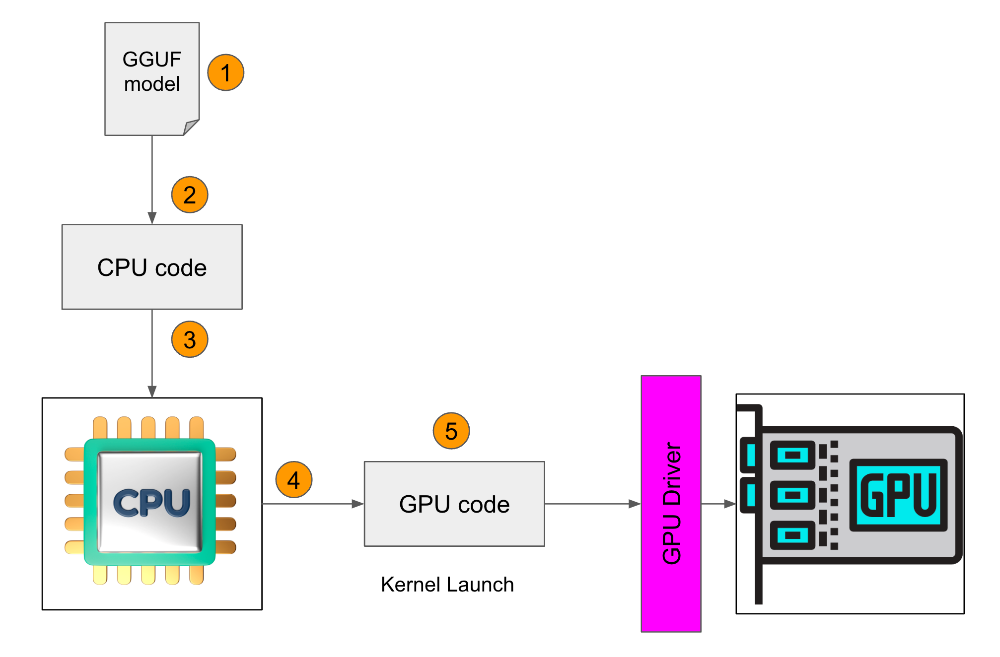

# =====================================
# CUDA
# =====================================
## NVCC Options for Separate Compilation
CUDA works by embedding device code into host objects. In whole program compilation, it embeds executable device code into the host object. In separate compilation, we embed relocatable device code into the host object, and run nvlink, the device linker, to link all the device code together. The output of nvlink is then linked together with all the host objects by the host linker to form the final executable.

The generation of relocatable vs executable device code is controlled by the --relocatable-device-code option.

The --compile option is already used to control stopping a compile at a host object, so a new option --device-c is added that simply does --relocatable-device-code=true --compile.

To invoke just the device linker, the --device-link option can be used, which emits a host object containing the embedded executable device code. The output of that must then be passed to the host linker. Or:

nvcc <objects>
can be used to implicitly call both the device and host linkers. This works because if the device linker does not see any relocatable code it does not do anything.

The following figure shows the flow.


CUDA Separate Compilation Trajectory

# =====================================
# llama.cpp
# =====================================
## Build
```bash
export LLAMA_DEBUG=1
export LLAMA_CUBLAS=1
export CUDA_DOCKER_ARCH=compute_75 # Tesla T4
export LLAMA_CUDA_NVCC=/usr/local/cuda/bin/nvcc
make
```

## Build Notes
```bash
# ggml-cuda.o
/usr/local/cuda/bin/nvcc --forward-unknown-to-host-compiler -use_fast_math -Wno-deprecated-gpu-targets -arch=compute_75 -DGGML_CUDA_DMMV_X=32 -DGGML_CUDA_MMV_Y=1 -DK_QUANTS_PER_ITERATION=2 -DGGML_CUDA_PEER_MAX_BATCH_SIZE=128 -I. -Icommon -D_XOPEN_SOURCE=600 -D_GNU_SOURCE -DNDEBUG -DGGML_USE_K_QUANTS -DGGML_USE_CUBLAS -I/usr/local/cuda/include -I/opt/cuda/include -I/targets/x86_64-linux/include  -std=c++11 -fPIC -O3 -Wall -Wextra -Wpedantic -Wcast-qual -Wno-unused-function -Wmissing-declarations -Wmissing-noreturn -pthread    -Wno-pedantic -Xcompiler "-Wno-array-bounds -Wno-format-truncation -Wextra-semi -march=native -mtune=native " -c ggml-cuda.cu -o ggml-cuda.o

# main
g++ -I. -Icommon -D_XOPEN_SOURCE=600 -D_GNU_SOURCE -DNDEBUG -DGGML_USE_K_QUANTS -DGGML_USE_CUBLAS -I/usr/local/cuda/include -I/opt/cuda/include -I/targets/x86_64-linux/include  -std=c++11 -fPIC -O3 -Wall -Wextra -Wpedantic -Wcast-qual -Wno-unused-function -Wmissing-declarations -Wmissing-noreturn -pthread  -Wno-array-bounds -Wno-format-truncation -Wextra-semi -march=native -mtune=native  examples/main/main.cpp ggml.o llama.o common.o console.o grammar-parser.o k_quants.o ggml-cuda.o ggml-alloc.o -o main -lcublas -lculibos -lcudart -lcublasLt -lpthread -ldl -lrt -L/usr/local/cuda/lib64 -L/opt/cuda/lib64 -L/targets/x86_64-linux/lib
```


## Download GGUF model
```bash
cd models
wget https://huggingface.co/TheBloke/Llama-2-13B-chat-GGUF/resolve/main/llama-2-13b-chat.Q4_0.gguf
cd ..
```

## Run
```bash
# Load /etc/ld.so.conf.d/cuda-11-0.conf
ldconfig

./main -m models/llama-2-13b-chat.Q4_0.gguf -ngl 100 -p "What is a Large Language Model?"
```

# =====================================
# C++
# =====================================
Code flow:

